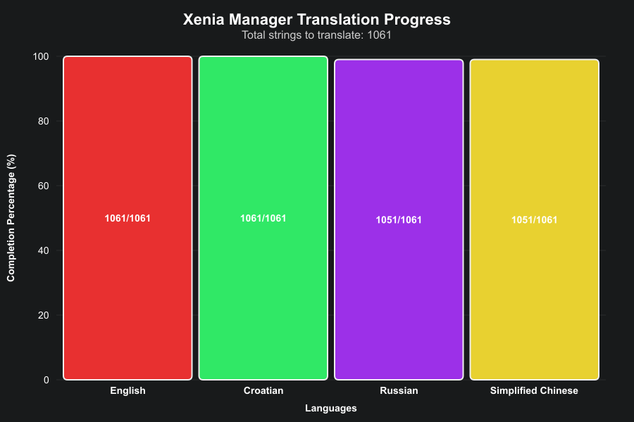

# Xenia Manager

> **Note:** This project is **not affiliated** with the official [Xenia Team](https://xenia.jp/).

---

**Xenia Manager** is a user-friendly tool designed to simplify the use of the [Xenia Emulator](https://xenia.jp/). It streamlines game management, patch installation, and configuration, all through an intuitive interface.

---

## Table of Contents

- [Main Features](#main-features)
- [Quickstart](#quickstart)
- [FAQ](#faq)
- [Contributing](#contributing)
- [Screenshots](#screenshots)
- [Translation Progress](#translation-progress)
- [Credits](#credits)
- [License](#license)

---

## Main Features

- ✅ **Easy 1-click setup for Xenia**
- 🔄 **Automatic updater for Xenia**
- 🛠️ **Support for [Canary](https://github.com/xenia-canary/game-patches) & [Netplay](https://github.com/AdrianCassar/Xenia-WebServices/tree/main/patches) game patches**
- 🎮 **Per-game configuration profiles** (with [community-optimized settings](https://github.com/xenia-manager/optimized-settings))
- 💾 **Import and export game saves**
- 💤 **Low resource usage**

---

## Quickstart

1. [**Download the latest release**](https://github.com/xenia-manager/xenia-manager/releases/latest/)
2. Unzip and run `XeniaManager.exe`.
3. Follow the [Quickstart guide](https://github.com/xenia-manager/xenia-manager/wiki/Quickstart) for detailed setup instructions.

---

## FAQ

If you have any questions, check out the [Frequently Asked Questions](https://github.com/xenia-manager/xenia-manager/wiki/FAQ) page.

---

## Contributing

We welcome contributions! Please read our [Contributing Guide](CONTRIBUTING.md) to get started.

- Check the open [issues](https://github.com/xenia-manager/xenia-manager/issues) and our [TODO list](https://github.com/orgs/xenia-manager/projects/2/) for ideas.
- Want to help with translations? See our [Translations Guide](TRANSLATIONS.md)!

---

## Screenshots

| Game Library (Grid) | Game Library (List) |
|:---------------------:|:------------------:|
| .png) | .png) |

| Library Game Right Click | Content Viewer |
|:-----------------------:|:--------------:|
|  |  |

| Patch Downloader | Patch Configurator |
|:----------------:|:-----------------:|
|  |  |

| Xenia Settings | Manage Xenia |
|:--------------:|:------------:|
|  |  |

| Manage Xenia (Installation) | Manage Xenia (Update) |
|:--------------------------:|:---------------------:|
| .gif) | .gif) |

| Manager Settings | About Page |
|:----------------:|:----------:|
|  |  |

---

## Translation Progress

---

## Credits

### Contributors

### Translators

- [Shazzaam](https://github.com/shazzaam7) – Croatian Translation
- [xxOrdulu52xx](https://github.com/xxOrdulu52xx) - German Translation
- [theheroGAC](https://github.com/theheroGAC) - Italian Translation
- [Captain HoodT](https://github.com/Captain-HoodT) - Korean Translation
- [ElTioRata](https://github.com/ElTioRata) – Spanish Translation

### Research & References

- [Xenia Team](https://xenia.jp/) – for creating Xenia
- [Team Resurgent](https://github.com/Team-Resurgent/Xbox360Toolkit) – for Xbox360Toolkit
- [LenovoLegionToolkit](https://github.com/BartoszCichecki/LenovoLegionToolkit/) – for configuration/settings inspiration

### Libraries Used

- [NvAPIWrapper](https://github.com/falahati/NvAPIWrapper) – NVIDIA Driver Settings
- [Magick.NET](https://github.com/dlemstra/Magick.NET) – for creating game icons
- [Serilog](https://serilog.net/) – logging and diagnostics
- [SteamKit2](https://github.com/SteamRE/SteamKit) – parsing Valve's VDF files
- [Tomlyn](https://github.com/xoofx/Tomlyn) – parsing .TOML files
- [WPF-UI by LepoCo](https://wpfui.lepo.co/) – UI framework

---

## Community & Support

- **Issues & Suggestions:** [GitHub Issues](https://github.com/xenia-manager/xenia-manager/issues)
- **Project Board:** [TODO List](https://github.com/orgs/xenia-manager/projects/2/)
- **Wiki:** [Project Wiki](https://github.com/xenia-manager/xenia-manager/wiki)

---

## License

This project is licensed under the [BSD-3 License](LICENSE).

---

**Thank you for using and supporting Xenia Manager!**