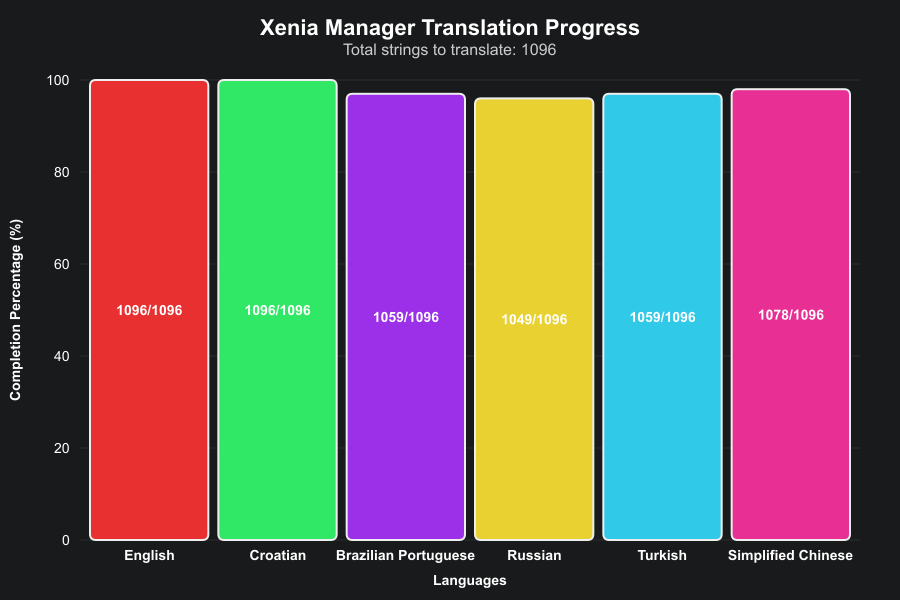

# Xenia Manager

> **Note:** This project is **not affiliated** with the official [Xenia Team](https://xenia.jp/).

---

**Xenia Manager** is a user-friendly tool designed to simplify the use of the [Xenia Emulator](https://xenia.jp/). It streamlines game management, patch installation, and configuration, all through an intuitive interface.

---

## Table of Contents

- [Main Features](#main-features)
- [Quickstart](#quickstart)
- [FAQ](#faq)
- [Contributing](#contributing)
- [Screenshots](#screenshots)
- [Translation Progress](#translation-progress)
- [Credits](#credits)
- [License](#license)

---

## Main Features

- **Easy 1-click setup for Xenia** with automatic profile creation
- **Automatic updater for Xenia** (configurable via settings)
- **Easy Content Installer & Manager** – Install DLC/TUs without launching Xenia
- **Support for [Canary](https://github.com/xenia-canary/game-patches) & [Netplay](https://github.com/AdrianCassar/Xenia-WebServices/tree/main/patches) game patches**
- **Advanced Patch Management** – Add, edit, and remove patches in a unified window with duplicate patch support
- **Per-game configuration profiles** (with [community-optimized settings](https://github.com/xenia-manager/optimized-settings))
- **Xenia Profile Management** – Import, export, and edit profiles with automatic save backups
- **Dynamic Xenia Settings UI** – Automatically adapts to Xenia's config file structure
- **Smart Steam Shortcuts** – Creates shortcuts with full artwork support
- **Cross-platform Input Listener** – Reliable keyboard/mouse input detection using Avalonia
- **Import and export game saves** with XUID-based backup system
- **Low resource usage** with on-demand loading and caching

---

## Quickstart

1. [**Download the latest release**](https://github.com/xenia-manager/xenia-manager/releases/latest/)
2. Unzip and run `XeniaManager.exe`.
3. Follow the [Quickstart guide](https://github.com/xenia-manager/xenia-manager/wiki/Quickstart) for detailed setup instructions.

---

## FAQ

If you have any questions, check out the [Frequently Asked Questions](https://github.com/xenia-manager/xenia-manager/wiki/FAQ) page.

---

## Contributing

We welcome contributions! Please read our [Contributing Guide](CONTRIBUTING.md) to get started.

- Check the open [issues](https://github.com/xenia-manager/xenia-manager/issues) and our [TODO list](https://github.com/orgs/xenia-manager/projects/2/) for ideas.
- Want to help with translations? See our [Translations Guide](TRANSLATIONS.md)!

---

## Screenshots

> **See more:** Browse our complete [Screenshots Gallery](assets/Screenshots/README.md) for additional interface views.

---

## Translation Progress

---

## Credits

### Contributors

### Translators

- [Roll8ack](https://github.com/Roll8ack) - Chinese (Simplified) Translation (v3 & v4)
- [Shazzaam](https://github.com/shazzaam7) – Croatian Translation (v3 & v4)
- [AC-DEV-WEB](https://github.com/AC-DEV-WEB) - French Translation (v3)
- [xxOrdulu52xx](https://github.com/xxOrdulu52xx) - German Translation (v3)
- [theheroGAC](https://github.com/theheroGAC) - Italian Translation (v3)
- [Captain HoodT](https://github.com/Captain-HoodT) - Korean Translation (v3)
- [Mavethee](https://github.com/mavethee) - Polish Translation (v3)
- [AndylgTom](https://github.com/AndylgTom) - Russian Translation (v4)
- [ElTioRata](https://github.com/ElTioRata) – Spanish Translation (v3)

### Research & References

- [Xenia Team](https://xenia.jp/) – for creating Xenia
- [Team Resurgent](https://github.com/Team-Resurgent/Xbox360Toolkit) – for Xbox360Toolkit
- [Free60](https://free60.org/) - for documentation on Xbox 360 file formats
- [LenovoLegionToolkit](https://github.com/BartoszCichecki/LenovoLegionToolkit/) – for configuration/settings inspiration

### Libraries Used

- [Avalonia UI](https://avaloniaui.net/) – cross-platform UI framework
- [FluentAvalonia](https://github.com/amwx/FluentAvalonia/) – Fluent Design controls for Avalonia
- [FluentIcons](https://github.com/davidxuang/FluentIcons) – Fluent Design icon library
- [NLog](https://github.com/NLog/NLog) – logging and diagnostics
- [Tomlyn](https://github.com/xoofx/Tomlyn) – TOML parser/writer
- [SharpCompress](https://github.com/adamhathcock/sharpcompress) – archive compression handling

---

## Community & Support

- **Issues & Suggestions:** [GitHub Issues](https://github.com/xenia-manager/xenia-manager/issues)
- **Project Board:** [TODO List](https://github.com/orgs/xenia-manager/projects/2/)
- **Wiki:** [Project Wiki](https://github.com/xenia-manager/xenia-manager/wiki)

---

## License

This project is licensed under the [BSD-3 License](LICENSE).

---

**Thank you for using and supporting Xenia Manager!**
