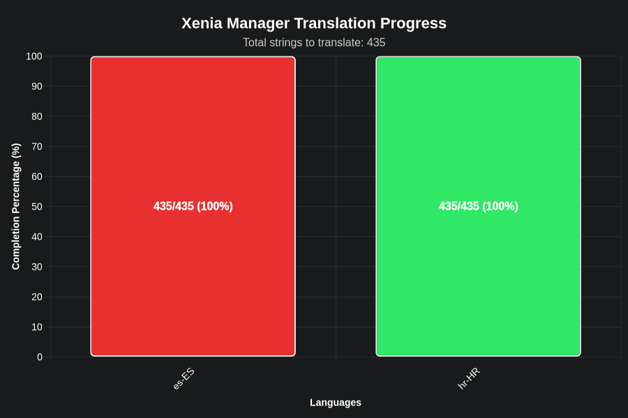

# Xenia Manager

Xenia Manager is a tool designed to simplify the use of the Xenia Emulator. It aims to make playing games and installing specific game patches more straightforward and user-friendly, while also providing an easy-to-use interface for adjusting Xenia settings.

<em>This project is not affiliated with the Xenia Team in any way.</em>

# Main features

- Easy 1-click setup for Xenia
- Automatic updater for Xenia
- Support for [game patches](https://github.com/xenia-canary/game-patches)
- Per game configuration profiles (Alongside [optimized settings for games](https://github.com/xenia-manager/Optimized-Settings) made by the community)
- Import and export game saves
- Low resource usage

# Quickstart

Head over to the [Quickstart page](https://github.com/xenia-manager/xenia-manager/wiki/Quickstart) to get started.

# FAQ

If you have any questions, hop over to the [frequently asked questions](https://github.com/xenia-manager/xenia-manager/wiki/FAQ) page.

## Contributing

Please read our [Contributing Guide](CONTRIBUTING.md) to get started.
Check the open [issues](https://github.com/xenia-manager/xenia-manager/issues) and our [TODO list](https://github.com/orgs/xenia-manager/projects/2/) for ideas.

If you want to do translations, check out [Translations Guide](TRANSLATIONS.md) to get started.

# Screenshots

    

    

    

    

    

    

    

    

    

    

    

    

## 🌍 Translation Progress

  

### Detailed Progress

- **hr-HR**: 422/422 strings (100%)
- **es-ES**: 394/422 strings (93%)

*Last updated: 2025-07-23*

# Credits

## Contributors

## Translators
- [ElTioRata](https://github.com/ElTioRata) - Spanish Translation 
- [Shazzaam](https://github.com/shazzaam7) - Croatian Translation

## Research & references

- [Xenia Team (for creating Xenia)](https://xenia.jp/)
- [Team Resurgent (for creating Xbox360Toolkit)](https://github.com/Team-Resurgent/Xbox360Toolkit)
- [LenovoLegionToolkit (used his version of configuration/settings)](https://github.com/BartoszCichecki/LenovoLegionToolkit/)

## Libraries used

- [NvAPIWrapper (NVIDIA Driver Settings)](https://github.com/falahati/NvAPIWrapper)
- [Magick.NET (for creating game icons)](https://github.com/dlemstra/Magick.NET)
- [Serilog (for logging and diagnostics)](https://serilog.net/)
- [SteamKit2 (parsing Valve's VDF file)](https://github.com/SteamRE/SteamKit)
- [Tomlyn (for parsing .TOML files)](https://github.com/xoofx/Tomlyn)
- [WPF-UI by LepoCo (UI)](https://wpfui.lepo.co/)